# MAFET — Multi-platform Utilities App

<p align="center">
  
  
  
  
  
  <a href="https://github.com/hrudhaykanth116/MAFET/actions/workflows/android-ci.yml"></a>
</p>

<p align="center">
  A <b>Kotlin Multiplatform</b> application sharing a single codebase across Android, iOS, and Desktop —<br>
  using Compose Multiplatform, Clean Architecture, Modularization.
</p>

---

## Demo & Screenshots

## 🌦️ Weather
Real-time weather dashboard with a clean iOS-first experience.

#### iOS

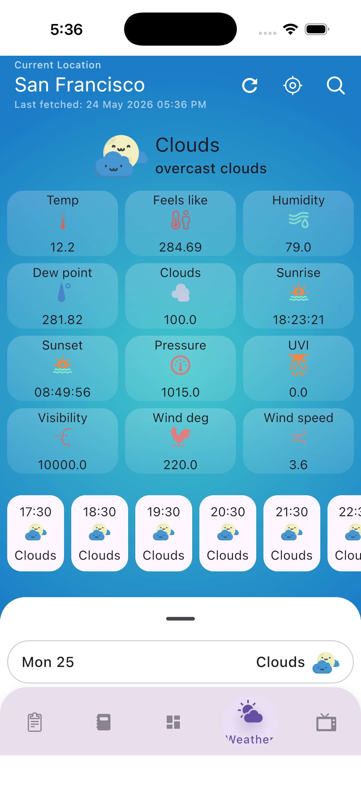

#### Android & Desktop

> _Coming soon..._

---

## 📺 TV Shows
Browse, search, add, edit, and bookmark TV shows with a smooth mobile experience.

#### iOS

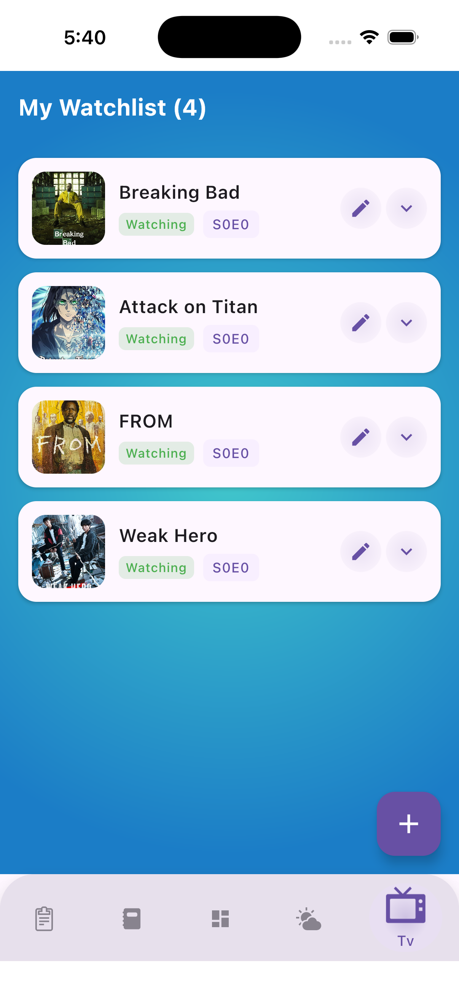
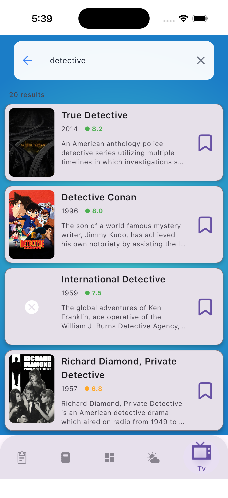
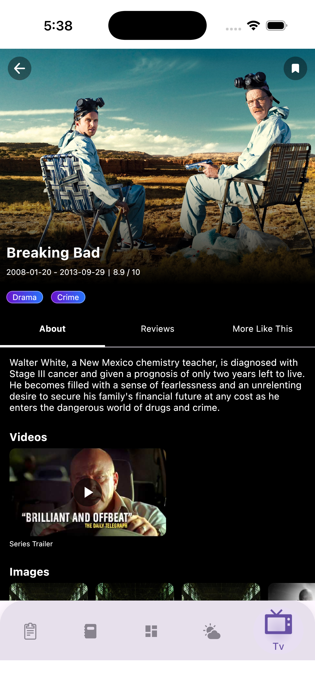
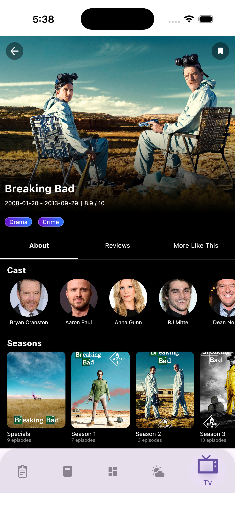

<br/>

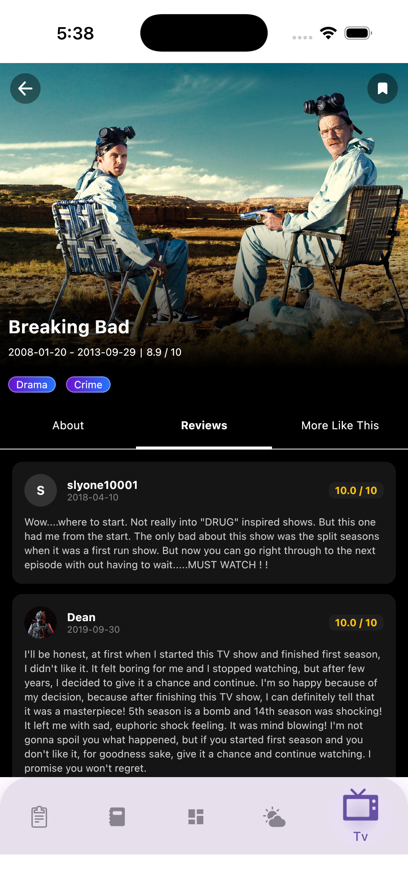
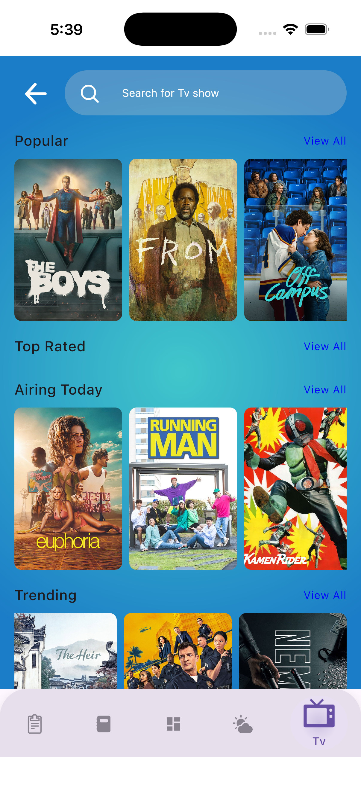
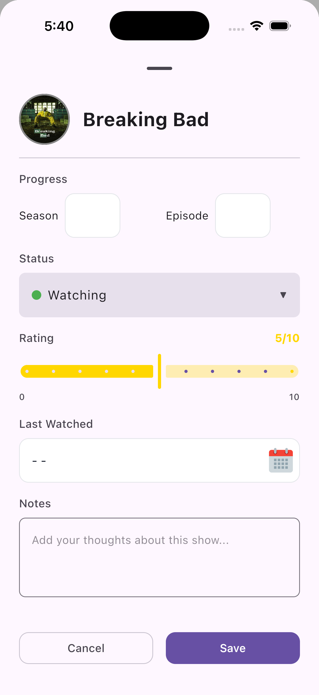
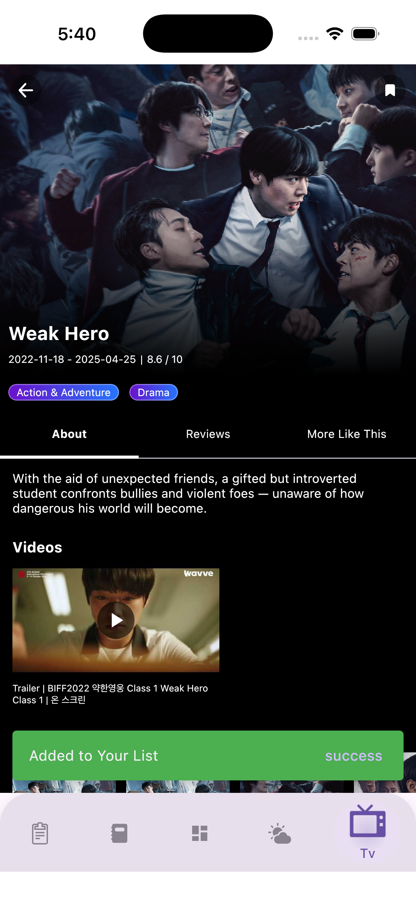

#### Android

> _Coming soon..._

---

## ✅ To-Do List
Simple and productive task management with a minimal iOS interface.

#### iOS

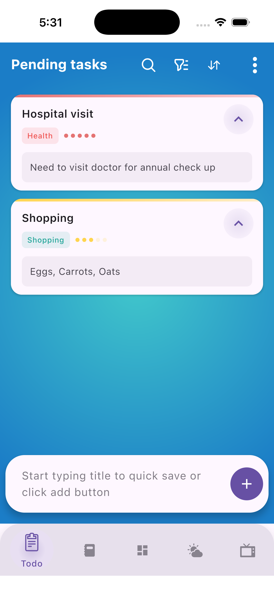
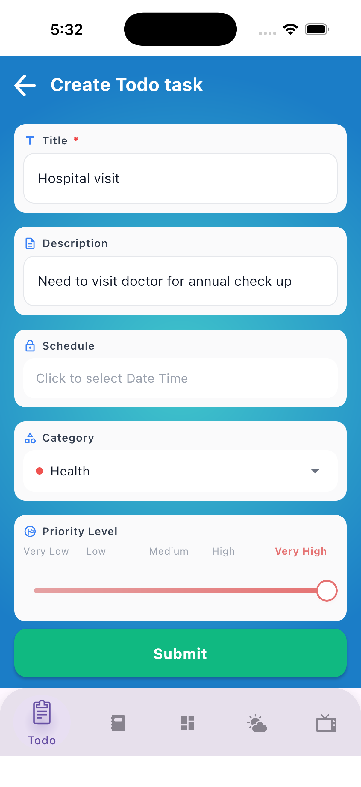

#### Android & Desktop

> _Coming soon..._

---

## Technical Highlights

- **~90% shared code** across Android, iOS, and Desktop via Kotlin Multiplatform + Compose Multiplatform
- **MVI architecture** with a custom `UIStateViewModel<STATE, EVENT, EFFECT>` base class enforcing unidirectional data flow
- **Multi-engine Ktor** networking — OkHttp on Android/Desktop, Darwin on iOS — unified under a single API layer
- **Type-safe DI** with Koin, scoped per module, with platform-specific actual implementations injected transparently
- **Live API integrations**: OpenWeatherMap, TMDB, Pexels, Firebase Vertex AI
- **CI/CD pipeline** via GitHub Actions running Android unit tests on every push

---

## Features

| Module             | Platforms                    | Status          |
|--------------------|------------------------------|-----------------|
| **Todo List**      | Android · iOS · Desktop      | ✅ Ready        |
| **TV Shows**       | Android · iOS                | ✅ Ready        |
| **Weather**        | Android · iOS                | ✅ Ready        |
| **Journal**        | Android · iOS · Desktop      | ✅ Ready        |
| **Media Gallery**  | Android · iOS · Desktop      | 🚧 In Progress  |
| **Authentication** | Android                      | 📋 Planned      |
| **AI Assistant**   | Android · iOS · Desktop      | 📋 Planned      |

---

## Architecture

MAFET follows **Clean Architecture** with a clear separation across three layers, all shared in `commonMain`. 
See [docs/architecture.md](docs/architecture.md) for full details.

---

## Tech Stack

| Category       | Library                  |
|----------------|--------------------------|
| Language       | Kotlin Multiplatform     |
| UI             | Compose Multiplatform    |
| DI             | Koin                     |
| Networking     | Ktor Client              |
| Database       | Room KMP                 |
| Image Loading  | Coil                     |
| Async          | Kotlinx Coroutines       |
| Serialization  | Kotlinx Serialization    |
| Date/Time      | Kotlinx DateTime         |
| Logging        | Kermit                   |
| Testing        | MockK                    |
| Firebase       | Firebase BOM             |
| Navigation     | Navigation Compose       |

**Build:** Android min SDK 24, target SDK 36 · Java 17 · KSP 2.2.0

---

## Getting Started

### Prerequisites

- JDK 17+
- Android Studio Ladybug (2024.2+) or IntelliJ IDEA
- Xcode 15+ _(iOS only)_

### API Keys

Create `secrets.properties` at the project root (gitignored):

```properties
PEXELS_API_KEY="your_pexels_api_key"
TMDB_API_KEY="your_tmdb_api_key"
OPEN_WEATHER_FORECAST_API_KEY="your_openweather_api_key"
```

For iOS, copy `iosApp/secrets.xcconfig.example` → `iosApp/secrets.xcconfig` and fill in the same keys. Then in Xcode: project root → **Info** tab → Configurations → set `secrets.xcconfig` for Debug and Release under the `iosApp` target.

| Service          | Get Key                                          | Used In   |
|------------------|--------------------------------------------------|-----------|
| TMDB             | https://www.themoviedb.org/settings/api          | TV Shows  |
| OpenWeatherMap   | https://home.openweathermap.org/api_keys         | Weather   |
| Pexels           | https://www.pexels.com/api/                      | Media     |

### Build & Run

```bash
git clone https://github.com/hrudhaykanth116/MAFET.git
cd MAFET

./gradlew :androidApp:installDebug   # Android
./gradlew :desktopApp:run            # Desktop
./gradlew allTests                   # All tests
```

For iOS: open `iosApp/iosApp.xcodeproj` in Xcode, select your dev team, build and run.

---

## Project Structure

```
MAFET/
├── androidApp/          # Android entry point (ads, MainActivity)
├── desktopApp/          # Desktop JVM entry point
├── iosApp/              # iOS SwiftUI wrapper
├── composeApp/          # Shared Compose navigation + app shell
│
├── core-common/         # Pure Kotlin utilities (extensions, logging, date/time)
├── core-domain/         # DomainResult<T>, DomainError — no platform deps
├── core-data/           # Repository abstractions, DataStore
├── core-network/        # Ktor client config, safe API call wrappers
├── core-ui/             # Shared components, UIStateViewModel, theme
│
└── features/
    ├── todo/            # KMP: Android + iOS + Desktop
    ├── tv/              # KMP: Android + iOS
    ├── weather/         # KMP: Android + iOS
    ├── journal/         # KMP: Android + iOS + Desktop
    ├── ai/              # KMP: Android + iOS + Desktop
    ├── media/           # KMP: Android + iOS + Desktop
    ├── auth/            # Android only (Firebase Auth)
    └── games/           # Android only (Compose Canvas)
```

---

## Roadmap

- [ ] Desktop support for TV Shows and Weather
- [ ] WorkManager background sync for Todo
- [ ] Local notifications for task reminders
- [ ] Widget support (Android — Todo, Weather)
- [ ] iOS HealthKit integration for Journal mood data
- [ ] End-to-end encryption for Journal entries
- [ ] Web support (Compose for Web)

---

## Author

**Hrudhay Kanth Thangella**

[](https://www.linkedin.com/in/hrudhay-thangella)
[](https://github.com/hrudhaykanth116)

**Email:** hrudhaykanth116@gmail.com

---

## License

MIT License — see [LICENSE.md](LICENSE.md) for details.

---

<p align="center">Built with Kotlin Multiplatform</p>
